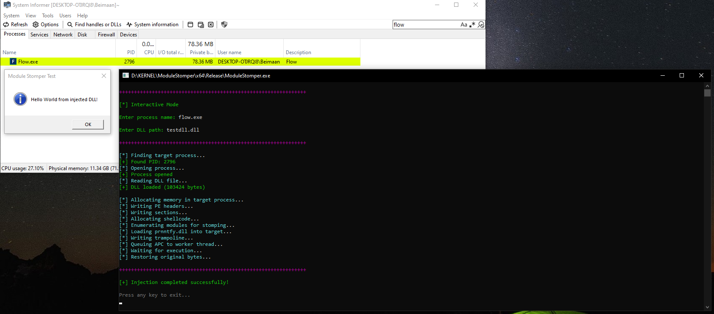

## How It Works

The injection happens in stages:

**1. Manual Map the DLL**
- Allocate memory and write our DLL into the target process
- Fix up relocations and imports manually (no LoadLibrary calls)
- Handle TLS callbacks and exception handlers

**2. Find a Module to Stomp**
- Look for prnntfy.dll (Windows print notification DLL - nobody uses this)
- If it's not loaded, we load it first
- Find its .text section (where the code lives)

**3. Write the Trampoline**
- Back up the original bytes from prnntfy.dll
- Write a small shellcode stub that jumps to our main payload
- This is the "stomping" part - we're overwriting legitimate code

**4. Queue APC to Worker Thread**
- Find threads that started in ntdll.dll (worker threads)
- These threads are usually in alertable wait states
- Queue our shellcode as an APC (Asynchronous Procedure Call)
- When the thread wakes up, it executes our code

**5. Execute & Cleanup**
- Shellcode runs and calls DllMain
- Wait 15 seconds for everything to initialize
- Restore the original bytes we stomped
- Clean up the trampoline

